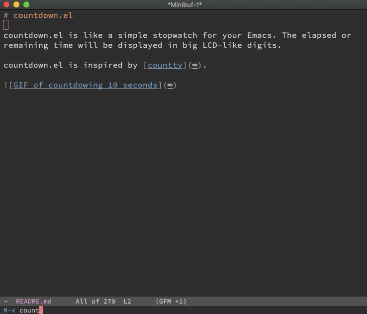

# countdown.el 

Countdown using big LCD-like digits. Inspired by [countty](https://uninformativ.de/git/countty).

## Requires

- Emacs 25
- [GNU ELPA - stream](http://elpa.gnu.org/packages/stream.html)

## Usage

### `M-x countdown 15`

Countdown 15 seconds.
